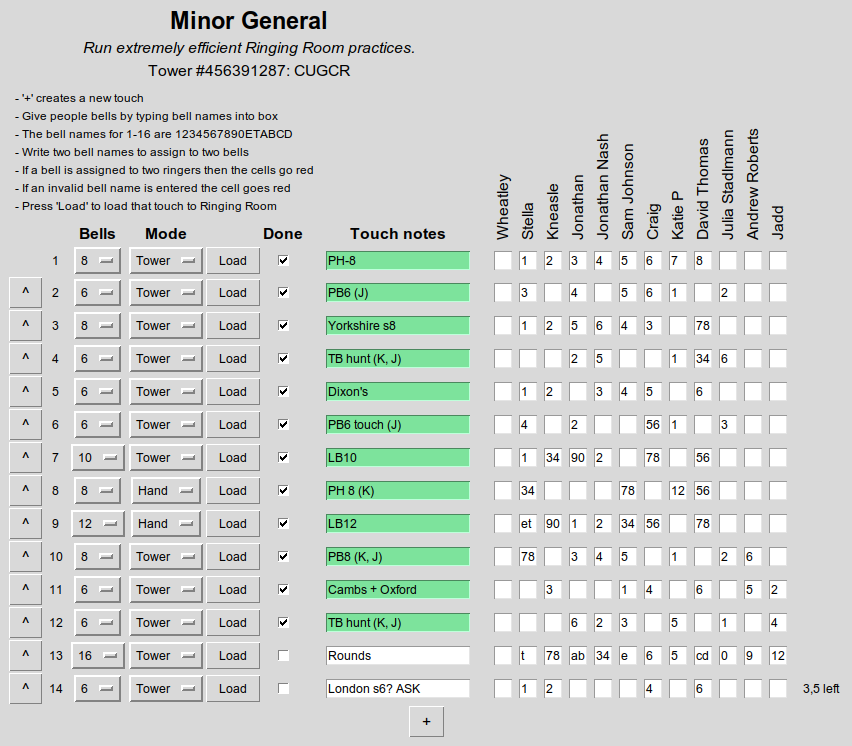
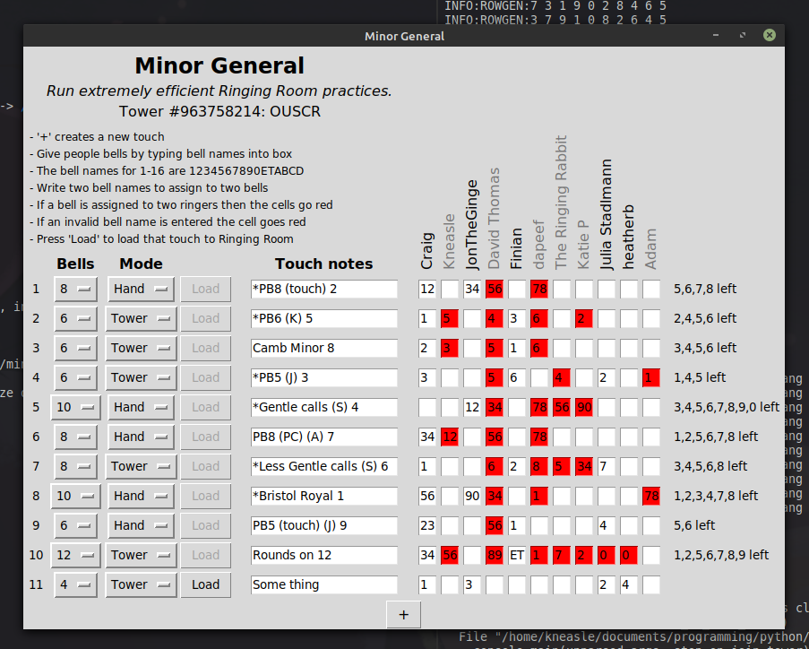

+++
title = "Minor General"
description = "Run extremely efficient Ringing Room practices"

date = 2021-02-04
formattedDate = "Feb-Apr 2021"

languages = ["python"]
topics = ["bell-ringing"]

[extra]
links = [
    ["GitHub", "https://github.com/kneasle/minor-general"],
]
+++

During 2020, I was running several Ringing Room practices by keeping a plan of the practice on
pen-and-paper.  And as the saying goes: why spend a few minutes doing a task when you can spend
several days automating it?

After emerging from various rabbit holes, this is the result!  I'm pretty pleased with it - it was
made pretty quickly, but is surprisingly useful and robust.  This screenshot is taken just before
the end of a real practice, in this case a joint practice between the Oxford and Cambridge
University Societies (oops, sorry, I mean Society and _Guild_. My bad...).  Also, cheeky photo-bomb from
[Wheatley](../wheatley), one of my other projects.

Minor General represents a practice as a matrix of cells, with a user-list (automatically updated
when users arrive/leave) on the x-axis and a list of 'touches' on the y-axis.  Each cell contains the
bells which should assigned to that user in that touch.  When you press `Load`, Minor General will
immediately update the Ringing Room tower to be ready for that touch.

Touches can be reordered (using the `^` buttons) and are automatically marked as 'done' once they
are `Load`ed.  Minor General also error-checks the assignments - cells will be highlighted red if
you assign two ringers to the same bell, or assign a bell to a ringer who has since left the
practice:

Also, Minor General helpfully reports which bells need to be assigned in order to complete the
touch (this can be seen in both screenshots).
