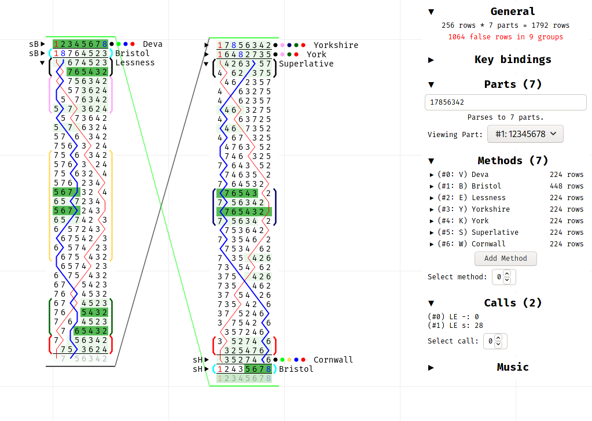

+++
title = "Jigsaw"
description = "A visual, incremental composing tool for change ringing"

weight = 120 # 1xx is for not-huge but completed projects

[extra]
links = [
    ["GitHub", "https://github.com/kneasle/jigsaw"],
    ["Prototype", "https://kneasle.github.io/jigsaw/firehose"],
]
+++

**Jigsaw** is a web app designed to be a sort of 'Microsoft Word' to aid people compose pieces of
[change ringing](https://en.wikipedia.org/wiki/Change_ringing).  Composing change ringing is
different in many ways to composing music; most notably, it is a mostly mathematical task with
strong rules that all compositions must follow (rules which are easy for computers to check).
Jigsaw lets you quickly sketch out composition ideas, providing instant feedback on all these rules.

<!-- more -->

_Quick disclaimer:_ Jigsaw is currently quite new and is missing many features needed for production
use (notably, it can't save your work).  It is also a little bit unstable and without a save
feature, a crash/freeze results in you having to redo your work.   Now that's out the way, you're
very welcome to play around; a recent build of Jigsaw is always available
[here](https://kneasle.github.io/jigsaw/firehose).

