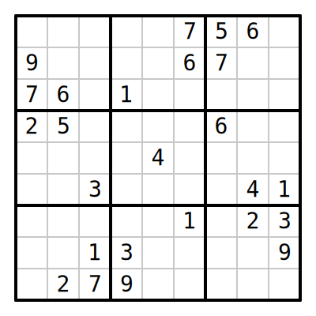
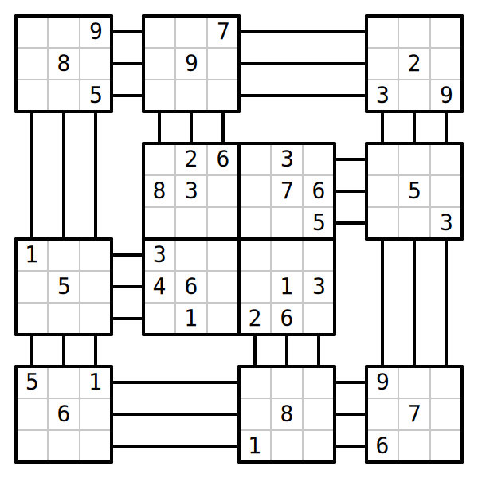
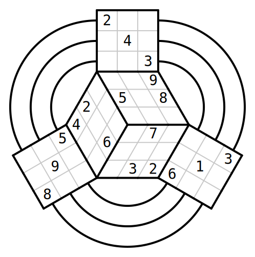
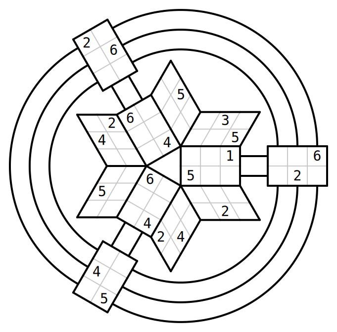

+++
title = "Kuudos"
description = "Creation tool for spicy sudokus"

weight = 120 # 1xx is for not-huge but basically working projects

[extra]
links = [
    ["GitHub", "https://github.com/kneasle/kuudos"],
]
+++

**Kuudos** is a Rust library that can generate, solve and render arbitrarily shaped sudokus.

In Kuudos, a sudoku shape is a collection of cells and a set of _groups_ of cells (i.e.
rows/columns or boxes).  For completeness, there is also a set of _digits_, which can be _assigned_
to the cells. For each group, the digits placed in each cell must be unique.  That's it.  A
_solution_ is an assignment of digits to cells where all the group constraints are satisfied.  A
_puzzle_ is, therefore, a 'partial' assignment of digits - i.e. an assignment where some cells may
be left empty and should be filled by the user.

<!-- more -->

For example, the classic 9x9 sudoku contains 81 cells, which are divided into 9 rows, 9 columns and
9 boxes = 27 groups (each of which contains 9 cells).

This project is currently quite young (but already good enough to generate awesomely spicy puzzles).
A few goals for the project are:
- Implement a fast SIMD-powered solver, probably using a generalisation of the algorithm used by Tom
  Dillon's solver, [Tdoku](https://github.com/t-dillon/tdoku).  There's also a very well-written
  [blog post](https://t-dillon.github.io/tdoku/) explaining how it works.
- Implement a good difficulty metric, probably using a solver which emulates human techniques.  This
  would then allow the puzzle generator to fine-tune the puzzle difficulty better than it currently
  can (right now, it simply tries to remove as many clues as possible - which generates puzzles with huge
  variance in difficulty).
- Make a web-based GUI for solving sudokus generated by Kuudos.  I can't use existing tools because,
  well, they rely on the puzzles being square.

# Example puzzles

Enough talk - here are some examples of exotically shaped puzzles generated by Kuudos.  I haven't
tried solving them by hand yet, so if you do manage to solve them, please let me know!

## Classic

## Wheel

## Race Track

## Space Station

